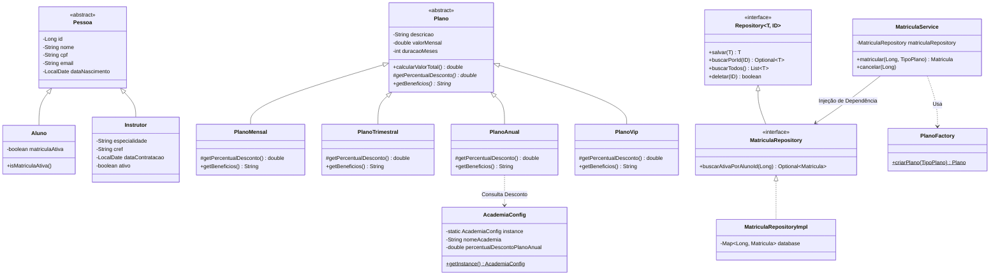

# Roteiro e Guia de Defesa do Código - Academia Quarta

Este documento foi elaborado para guiar a equipe durante a apresentação oral e defesa do projeto **Academia Quarta**. Ele atende integralmente aos 6 requisitos solicitados pela banca avaliadora.

---

## 1. Demonstrar o Funcionamento do Sistema

### Como Executar o Sistema
No terminal, navegue até a pasta raiz do projeto e execute os comandos:

```bash
# 1. Compilar os arquivos Java com codificação UTF-8
javac -encoding UTF-8 -d bin -sourcepath src src/com/academia/Main.java src/com/academia/config/*.java src/com/academia/exception/*.java src/com/academia/factory/*.java src/com/academia/model/*.java src/com/academia/repository/*.java src/com/academia/service/*.java

# 2. Executar a demonstração principal
java -cp bin com.academia.Main
```

### Roteiro de Apresentação Passo a Passo (O que falar durante a execução)

1. **Abertura & Leitura de Configurações Globais (Singleton)**
   - *Falar:* "Iniciamos a demonstração exibindo a leitura das configurações globais da academia através da classe `AcademiaConfig`, implementada com o padrão **Singleton**. Vemos o nome da academia, horários de funcionamento e a taxa de desconto global para o Plano Anual (15%)."

2. **Inicialização das Camadas com Injeção de Dependência**
   - *Falar:* "Em seguida, a `Main` instancia as implementações concretas de dados (`AlunoRepositoryImpl`, `InstrutorRepositoryImpl`, etc.) e as **injeta via construtor** nos serviços de negócio (`AlunoService`, `MatriculaService`, etc.). Isso garante desacoplamento total."

3. **Cadastro de Entidades (Herança e Polimorfismo)**
   - *Falar:* "Cadastramos o instrutor Carlos Silva e os alunos Enzo Hashimoto e Mariana Costa. Ambas as entidades estendem a classe abstrata `Pessoa`, demonstrando o princípio de reuso por herança (LSP)."

4. **Matrícula com Padrão Factory Method & Cálculo de Preço (OCP / Template Method)**
   - *Falar:* "Ao matricular o aluno Enzo no plano **ANUAL** e a aluna Mariana no plano **VIP**, não instanciamos as classes concretas diretamente no serviço. Utilizamos o `PlanoFactory.criarPlano(tipoPlano)`. O valor total é calculatedo automaticamente pelo método `calcularValorTotal()`, que aplica o desconto correto de cada plano."

5. **Prescrição de Ficha de Treino**
   - *Falar:* "Por fim, o serviço `TreinoService` valida se o aluno possui matrícula ativa, associa um instrutor responsável e prescreve exercícios específicos com séries, repetições e tempo de descanso."

---

## 2. Diagrama de Classes e Arquitetura

### Visualização do Diagrama em Mermaid



### Explicação da Arquitetura
- **Camada Model (Domínio):** Contém as entidades de negócio (`Pessoa`, `Aluno`, `Instrutor`, `Plano`, `Matricula`, `Treino`, `Exercicio`).
- **Camada Repository (Acesso a Dados):** Define abstrações genéricas com `Repository<T, ID>` e implementações concretas em memória usando `ConcurrentHashMap`.
- **Camada Service (Regras de Negócio):** Isola a lógica da aplicação (`MatriculaService`, `TreinoService`, `AlunoService`, `InstrutorService`).
- **Camada Factory e Config:** Centraliza a criação de objetos (`PlanoFactory`) e parâmetros globais do sistema (`AcademiaConfig`).

---

## 3. Identificação da Injeção de Dependência

A **Injeção de Dependência (DI)** foi implementada via **Construtor** em todas as classes da camada `Service`.

### Locais Exatos no Código

1. **`MatriculaService.java`**
   ```java
   private final MatriculaRepository matriculaRepository;

   // Injeção de Dependência via Construtor
   public MatriculaService(MatriculaRepository matriculaRepository) {
       this.matriculaRepository = matriculaRepository;
   }
   ```
   *Explicação:* `MatriculaService` não cria o repositório com `new MatriculaRepositoryImpl()`. Ele recebe a interface `MatriculaRepository`.

2. **`TreinoService.java`**
   ```java
   private final TreinoRepository treinoRepository;
   private final AlunoRepository alunoRepository;
   private final InstrutorRepository instrutorRepository;

   // Injeção de Múltiplas Dependências via Construtor
   public TreinoService(TreinoRepository treinoRepository,
                        AlunoRepository alunoRepository,
                        InstrutorRepository instrutorRepository) {
       this.treinoRepository = treinoRepository;
       this.alunoRepository = alunoRepository;
       this.instrutorRepository = instrutorRepository;
   }
   ```

3. **`AlunoService.java` & `InstrutorService.java`**
   - Ambos seguem rigorosamente o mesmo padrão de injeção via construtor recebendo `AlunoRepository` e `InstrutorRepository`.

### Por que a Injeção de Dependência foi utilizada?
- **Desacoplamento:** A camada de serviço não se preocupa em como os dados são salvos (se é em memória, MySQL ou PostgreSQL).
- **Testabilidade:** Facilita a criação de testes unitários automatizados através do envio de objetos simulados (Mocks).
- **Flexibilidade:** Permite trocar a implementação do repositório na `Main` sem alterar uma única linha dos serviços.

---

## 4. Justificativa dos Princípios SOLID Adotados

| Princípio | Sigla | Onde foi Aplicado no Código | Justificativa / Benefício |
| :--- | :---: | :--- | :--- |
| **Single Responsibility Principle** | **SRP** | Em todas as classes (`Service`, `Repository`, `Model`, `Factory`) | Cada classe possui uma única responsabilidade. O repositório apenas persiste, a service valida a regra de negócio e a fábrica instancia objetos. |
| **Open/Closed Principle** | **OCP** | Hierarquia de `Plano` (`PlanoMensal`, `PlanoTrimestral`, `PlanoAnual`, `PlanoVip`) | O sistema está aberto para expansão (podemos adicionar `PlanoSemestral` criando uma nova classe) e fechado para modificação (`calcularValorTotal()` permanece intocado). |
| **Liskov Substitution Principle** | **LSP** | `Aluno` / `Instrutor` herdam de `Pessoa`; Subclasses de `Plano` | Qualquer subclasse pode substituir a classe pai sem quebrar o comportamento do programa. |
| **Interface Segregation Principle** | **ISP** | `Repository<T, ID>`, `AlunoRepository`, `MatriculaRepository` | Criamos interfaces específicas para cada entidade, evitando forçar métodos desnecessários em classes que não os utilizam. |
| **Dependency Inversion Principle** | **DIP** | Todos os `Services` dependem de interfaces de `Repository` | Módulos de alto nível (Serviços) não dependem de módulos de baixo nível (Implementação do Banco), mas sim de abstrações (Interfaces). |

---

## 5. Explicação dos Padrões de Projeto Escolhidos

### A. Factory Method / Simple Factory (`PlanoFactory`)
- **Problema Resolvido:** Evita espalhar a criação manual de instâncias de `Plano` pelo sistema.
- **Como Funciona:** O método estático `PlanoFactory.criarPlano(tipoPlano)` recebe o enum `TipoPlano` e retorna a instância apropriada (`PlanoMensal`, `PlanoAnual`, etc.).
- **Vantagem:** Isola a lógica de instanciação em um único ponto da aplicação.

### B. Singleton (`AcademiaConfig`)
- **Problema Resolvido:** Garante que haja apenas **uma única instância** de configuração compartilhada da academia.
- **Como Funciona:** Possui construtor privado (`private AcademiaConfig()`) e acesso controlado pelo método sincronizado `getInstance()`.
- **Vantagem:** Evita a criação desnecessária de múltiplos objetos de configuração e garante consistência global nos dados (como percentual de desconto e horários).

### C. Repository Pattern (`Repository<T, ID>`)
- **Problema Resolvido:** Abstrai os detalhes do mecanismo de armazenamento de dados.
- **Como Funciona:** Encapsula operações de acesso a dados em interfaces como `AlunoRepository`, simulando um banco relacional em memória com `ConcurrentHashMap`.

### D. Template Method (`Plano.calcularValorTotal()`)
- **Problema Resolvido:** Padroniza o algoritmo de cálculo do valor total do plano.
- **Como Funciona:** A classe base `Plano` define a fórmula `valorMensal * duracaoMeses * (1 - getPercentualDesconto())`, enquanto cada subclasse implementa apenas a variação do método `getPercentualDesconto()`.

---

## 6. Guia de Perguntas e Respostas Frequentes (FAQ da Defesa)

> **P1: Por que vocês usaram interfaces para os repositórios se só existe uma única implementação em memória (`AlunoRepositoryImpl`)?**
> *Resposta:* Aplicamos o **DIP (Dependency Inversion Principle)**. O uso de interfaces permite que, no futuro, a equipe substitua a persistência em memória por um banco relacional (ex: JPA/Spring Data ou JDBC) sem alterar uma única linha de código nas classes de serviço (`AlunoService`, `MatriculaService`).

> **P2: Qual é a diferença entre a Herança que vocês usaram em `Pessoa` e a Injeção de Dependência no `MatriculaService`?**
> *Resposta:* A Herança representa uma relação do tipo **"É UM"** (`Aluno` é uma `Pessoa`, compartilhando atributos como nome, CPF e e-mail). A Injeção de Dependência representa uma relação do tipo **"USA UM"** (`MatriculaService` usa um `MatriculaRepository` para persistir os dados).

> **P3: Se a academia quiser criar um novo plano "Plano Semestral", quais arquivos precisam ser alterados?**
> *Resposta:* Graças ao **OCP (Open/Closed)** e ao **Factory Method**, precisamos apenas:
> 1. Criar a nova subclasse `PlanoSemestral extends Plano`;
> 2. Adicionar a opção `SEMESTRAL` no enum `TipoPlano`;
> 3. Adicionar o `case SEMESTRAL:` dentro do `PlanoFactory`.
> **Nenhuma** classe de serviço ou o método de cálculo existente precisa ser modificado!

> **P4: Por que o construtor da classe `AcademiaConfig` é privado?**
> *Resposta:* O construtor é privado para impedir que outras partes do sistema instanciem `new AcademiaConfig()` diretamente, o que violaria o padrão **Singleton**. A única forma de obter a configuração é através do método global `AcademiaConfig.getInstance()`.

> **P5: Onde no código o princípio SRP (Responsabilidade Única) fica mais evidente?**
> *Resposta:* Fica evidente na separação de responsabilidades:
> - `Matricula`: representa apenas a estrutura de dados da matrícula;
> - `MatriculaRepository`: cuida exclusivamente do armazenamento e busca de dados;
> - `MatriculaService`: cuida estritamente das regras de negócio (validar se aluno já tem matrícula ativa, se ID é válido);
> - `PlanoFactory`: cuida exclusivamente da decisão de qual plano instanciar.
